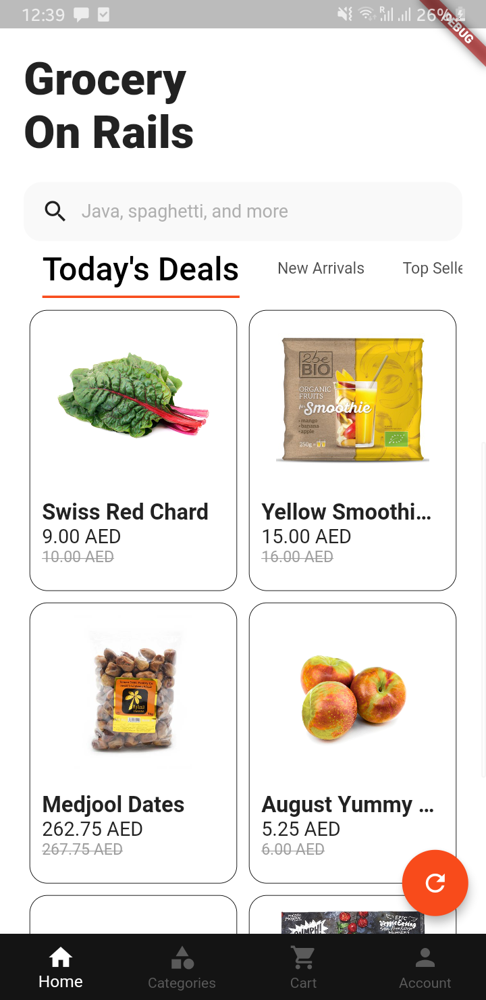
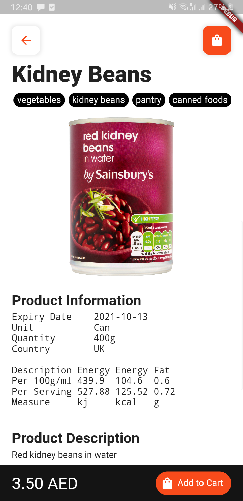
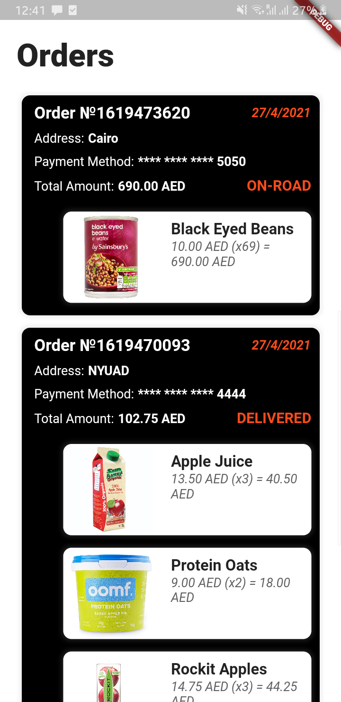
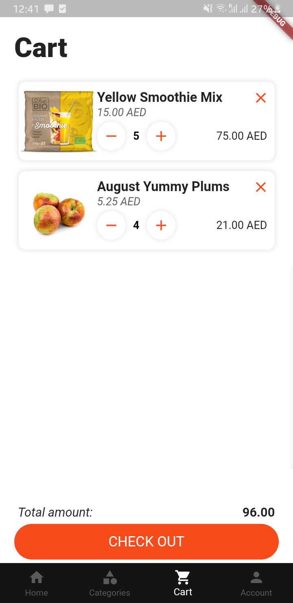
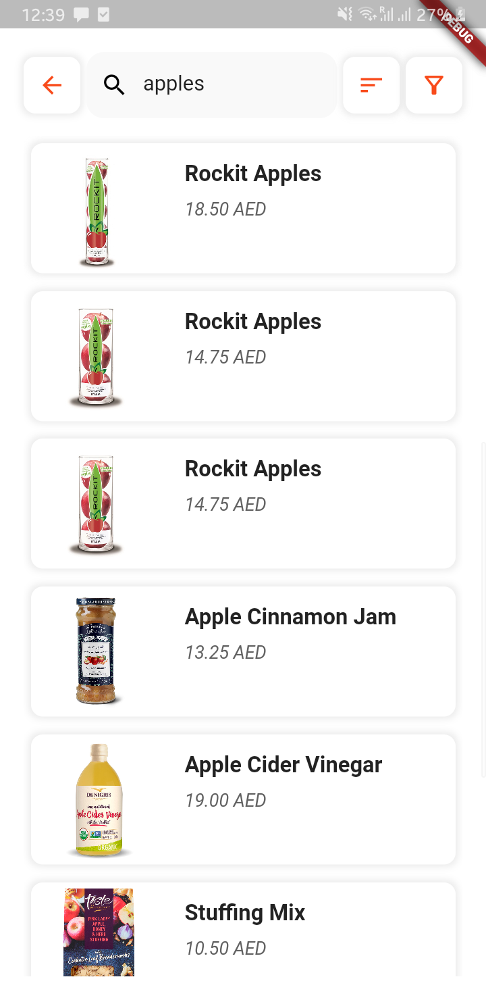
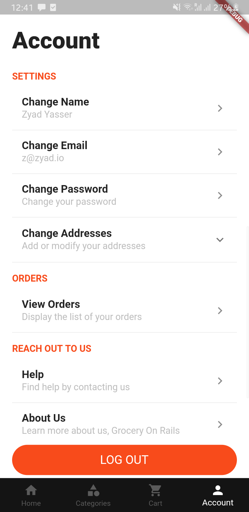
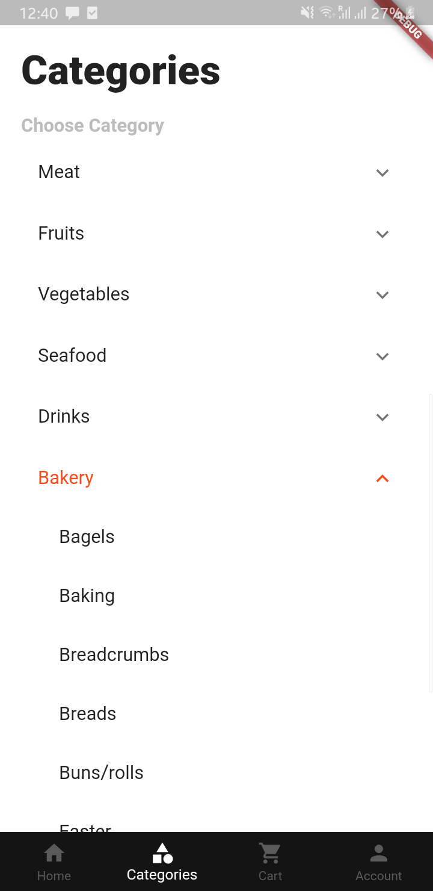
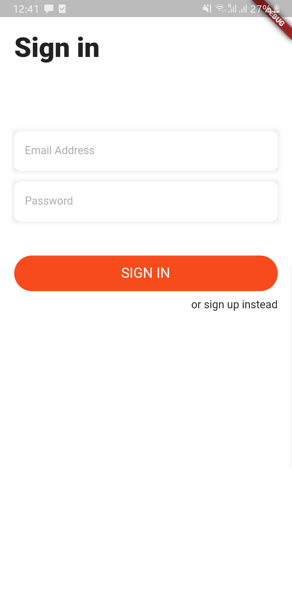

# Grocery on Rails

eGrocery app built with flutter

This repo represents the mobile app part of the project of the Software Engineering Course (CS-UH 2012) at New York University Abu Dhabi, Spring 2021

That project was developed using *Agile Scrum* software development methodology as described in the [project documentation](/project_documentation.pdf)

## Functionalities
The following list represents the main features implemented in the application
1. Sign-up for new customers
2. Sign-in for already existing customers
3. Modify Account (email, password, name, and address)
4. Searching (filtering, and sorting)
5. Categories view
6. Product view
7. Adding product to shopping cart
8. Modifying shopping cart
9. Viewing best deals
10. Viewing a recommended list of items
11. Finalizing order
12. Access order history

## Screenshots

Home Page                  |  Product Page             | Orders Page                |  Cart Page
:-------------------------:|:-------------------------:|:--------------------------:|:-------------------------:
       |    |      |  

Search Page                |  Account Page             | Categories Page            |  Sign-in Page
:-------------------------:|:-------------------------:|:--------------------------:|:-------------------------:
     |    |  |  
